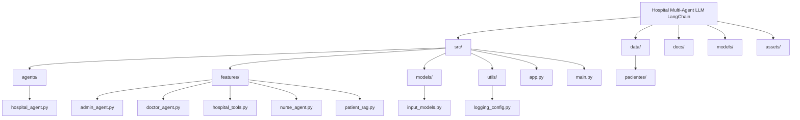

# 🏥 Hospital Multi-Agent LLM LangChain Project 🧑‍⚕️🩺

Welcome to the **Hospital Multi-Agent LLM LangChain** project! 🚀 This project is a cutting-edge implementation of a multi-agent system designed to simulate a hospital environment using **Large Language Models (LLMs)** and **LangChain**. Below is a detailed overview of the project.

## 📚 Project Overview

This project uses a combination of multiple AI agents, each with specialized roles, to assist in various hospital operations. The agents can perform tasks such as diagnosing patients, scheduling appointments, and retrieving patient records.


## 🎯 Diagram

The following diagram illustrates the project structure and key components:




### 🧠 Key Components

- **Language Models (LLMs)**: Powered by OpenAI's GPT models, these are used to simulate conversations and interactions with the agents.
- **LangChain**: A framework that enables the integration of LLMs with various tools and APIs.
- **Multi-Agent System**: Includes agents like DoctorAgent, NurseAgent, and AdminAgent, each with specific responsibilities.
- **Retrieval-Augmented Generation (RAG)**: Enhances the system’s ability to retrieve and generate accurate information from a large database of patient records.

## 🏗️ Project Structure

Here's an overview of the project structure:

```plaintext
hospital-multiagent-llm-langchain/
├── data/
│   └── pacientes/       # Patient records stored as text files
├── src/
│   ├── agents/
│   │   └── hospital_agent.py   # Main agent managing the interaction between tools and LLM
│   ├── features/
│   │   ├── admin_agent.py      # Agent handling administrative tasks like scheduling
│   │   ├── doctor_agent.py     # Agent for diagnosing patients based on symptoms
│   │   ├── hospital_tools.py   # Collection of tools used by different agents
│   │   ├── nurse_agent.py      # Agent for checking vitals and assisting in patient care
│   │   └── patient_rag.py      # RAG system for retrieving patient records
│   ├── models/
│   │   └── input_models.py     # Pydantic models for validating input data
│   ├── utils/
│   │   └── logging_config.py   # Configuration for logging throughout the project
│   ├── app.py                  # Main Streamlit app entry point
│   └── main.py                 # Script to run the application
├── notebooks/
│   └── demoMultiAgent.ipynb    # Jupyter notebook demonstrating the multi-agent system
├── docs/
│   └── ...                     # Documentation files
├── poetry.lock                 # Poetry lock file for managing dependencies
├── pyproject.toml              # Project configuration file
└── README.md                   # Project README file
```


## 🚀 Getting Started

Follow these steps to get started with the project:

### 1. Clone the Repository:

```bash
git clone https://github.com/infantesromeroadrian/Hospital-MultiAgentLLMLangchain.git
cd hospital-multiagent-llm-langchain
```

### 2. Install Dependencies:

```bash
poetry install
```

### 3. Run the Application:

```bash
streamlit run src/app.py
```

### 4. Explore the Project:
```

🔧 Features
Multi-Agent System: Simulates hospital operations with specialized agents.
Patient Record Retrieval: Uses RAG (Retrieval-Augmented Generation) for efficient data retrieval.
Streamlit Integration: User-friendly web interface for interacting with the system.
Custom Tooling: Extendable tools for diagnosing, scheduling, and more.

🛠️ Tools & Technologies
Language Models: OpenAI's GPT models for conversational AI.
LangChain Framework: Integrates LLMs with various tools and APIs.
Streamlit: Web application framework for building interactive apps.
Pydantic: Data validation and parsing library for Python.
Poetry: Dependency management tool for Python projects.

👥 Contributors
- Adrian Infantes (@adrianinfantes)

📝 License
This project is licensed under the MIT License - see the LICENSE file for details.

